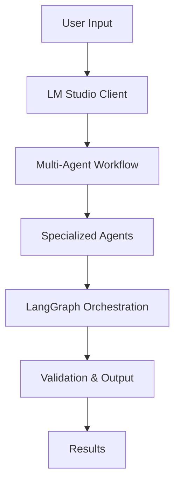

# AI Agent Toolkit

🤖 **A comprehensive collection of intelligent AI agents for code generation, document processing, and data insights**

[](https://python.org)
[](https://github.com/langchain-ai/langgraph)
[](https://lmstudio.ai)
[](LICENSE)

This repository contains three powerful AI-driven applications built with LangGraph and LM Studio, each designed to solve specific automation challenges in software development, healthcare, and data analysis.

## 🚀 Projects Overview

| Project | Description | Key Features |
|---------|-------------|--------------|
| **[Code Generator](#-code-generator)** | Automated code modification using multi-agent workflows | Configuration-driven, Multi-agent architecture, Code validation |
| **[Pharma AI Processor](#-pharma-ai-processor)** | Clinical prescription and medical bill processing | OCR extraction, Clinical coding, Excel export |
| **[Query to Insights](#-query-to-insights)** | Natural language to SQL conversion agent | NL2SQL, Database integration, Query optimization |

## 📁 Repository Structure

```
ai-agent-toolkit/
├── code_generator/           # Automated code modification system
├── pharma-ai-processor/      # Medical document processing
├── query_to_insights/        # Natural language to SQL converter
├── requirements.txt          # Global dependencies
├── .gitignore               # Git ignore rules
├── LICENSE                  # MIT License
└── README.md               # This file
```

## 🛠️ Prerequisites

Before running any of the projects, ensure you have:

- **Python 3.8+** installed
- **[LM Studio](https://lmstudio.ai/)** downloaded and running
- **Compatible LLM models** loaded in LM Studio
- **Git** for cloning the repository

## 🔧 Quick Setup

1. **Clone the repository**
   ```bash
   git clone https://github.com/your-username/ai-agent-toolkit.git
   cd ai-agent-toolkit
   ```

2. **Install global dependencies**
   ```bash
   pip install -r requirements.txt
   ```

3. **Set up LM Studio**
   - Download and install LM Studio
   - Load appropriate models for each project
   - Start the local server (usually `http://localhost:1234`)

4. **Choose and configure a project**
   - Navigate to the specific project directory
   - Follow the individual setup instructions

## 🤖 Code Generator

**Intelligent code modification using multi-agent workflows**

### Features
- ✅ Configuration-driven code modifications
- ✅ Multi-agent architecture (Parser, Identifier, Generator, Validator)
- ✅ Automatic file detection and modification
- ✅ Code validation and error fixing
- ✅ Interactive CLI interface

### Quick Start
```bash
cd code_generator
pip install -r requirements.txt
python main.py --config examples/sample_config.json --project examples/sample_project
```

### Use Cases
- Automated refactoring of data pipelines
- Configuration-based code updates
- Batch code modifications
- Legacy code modernization

**[📖 Full Documentation](code_generator/README.md)**

---

## 🏥 Pharma AI Processor

**AI-powered clinical document processing and coding**

### Features
- ✅ OCR text extraction from prescription images
- ✅ Medical information structuring
- ✅ Clinical coding (ICD-10, NDC, CPT)
- ✅ Excel report generation
- ✅ Batch processing capabilities

### Quick Start
```bash
cd pharma-ai-processor
pip install -r requirements.txt
python src/main.py --input data/input/prescription.jpg --output data/output
```

### Use Cases
- Digital prescription processing
- Medical bill analysis
- Clinical data extraction
- Healthcare document automation

**[📖 Full Documentation](pharma-ai-processor/README.md)**

---

## 📊 Query to Insights

**Natural language to SQL conversion with intelligent query optimization**

### Features
- ✅ Natural language to SQL translation
- ✅ Database schema understanding
- ✅ Query validation and optimization
- ✅ Multi-database support
- ✅ Interactive query interface

### Quick Start
```bash
cd query_to_insights
pip install -r requirements.txt
python setup_database.py
python main.py
```

### Use Cases
- Business intelligence queries
- Data exploration and analysis
- Non-technical user database access
- Automated report generation

**[📖 Full Documentation](query_to_insights/README.md)**

---

## 🏗️ Architecture

All projects share a common architectural pattern:



### Key Components

- **LangGraph**: Workflow orchestration and agent coordination
- **LM Studio**: Local LLM hosting and API interface
- **Specialized Agents**: Task-specific AI agents for different domains
- **Validation Systems**: Automated quality assurance and error correction

## 🚀 Getting Started Guide

### 1. Choose Your Use Case

| If you want to... | Use this project |
|-------------------|------------------|
| Automatically modify code files | **Code Generator** |
| Process medical documents | **Pharma AI Processor** |
| Convert natural language to SQL | **Query to Insights** |

### 2. Set Up Your Environment

```bash
# Clone and enter the repository
git clone https://github.com/your-username/ai-agent-toolkit.git
cd ai-agent-toolkit

# Install global dependencies
pip install -r requirements.txt

# Navigate to your chosen project
cd [project-name]

# Install project-specific dependencies
pip install -r requirements.txt
```

### 3. Configure LM Studio

- **Code Generator**: Requires code-specialized models (CodeLlama, Mistral, etc.)
- **Pharma AI Processor**: Requires vision-language models (LLaVA, GPT-4V compatible)
- **Query to Insights**: Requires code-capable models with SQL knowledge

### 4. Run Your First Example

Each project includes example configurations and sample data to get you started quickly.

## 🔧 Configuration

### Environment Variables

Create a `.env` file in each project directory:

```env
# LM Studio Configuration
LM_STUDIO_BASE_URL=http://localhost:1234/v1
LM_STUDIO_API_KEY=your-api-key-here

# Model Configuration
MODEL_NAME=your-model-name
TEMPERATURE=0.1
MAX_TOKENS=4000
```

### Model Recommendations

| Project | Recommended Models | Min VRAM |
|---------|-------------------|----------|
| Code Generator | CodeLlama 7B/13B, Mistral 7B | 8GB |
| Pharma AI Processor | LLaVA-v1.6, Qwen-VL | 12GB |
| Query to Insights | CodeLlama 7B, Mistral 7B | 8GB |

## 📈 Performance Optimization

### Tips for Better Results

1. **Model Selection**: Choose specialized models for your use case
2. **Temperature Settings**: Lower values (0.1-0.3) for consistent outputs
3. **Context Management**: Keep prompts focused and relevant
4. **Batch Processing**: Process multiple items together when possible

### System Requirements

- **Minimum**: 16GB RAM, 8GB VRAM
- **Recommended**: 32GB RAM, 16GB+ VRAM
- **Storage**: 50GB+ for models and data

## 🧪 Testing

### Run All Tests
```bash
# Test each project individually
cd code_generator && python main.py --validate-setup
cd ../pharma-ai-processor && python src/main.py --health-check
cd ../query_to_insights && python main.py test
```

### Continuous Integration

Each project includes validation scripts for automated testing and deployment.

## 🤝 Contributing

We welcome contributions! Here's how to get started:

1. **Fork the repository**
2. **Create a feature branch**: `git checkout -b feature/amazing-feature`
3. **Make your changes** and add tests
4. **Commit your changes**: `git commit -m 'Add amazing feature'`
5. **Push to the branch**: `git push origin feature/amazing-feature`
6. **Open a Pull Request**

### Development Guidelines

- Follow PEP 8 coding standards
- Add comprehensive docstrings
- Include unit tests for new features
- Update documentation as needed

## 📚 Documentation

- [Code Generator Documentation](code_generator/README.md)
- [Pharma AI Processor Documentation](pharma-ai-processor/README.md)
- [Query to Insights Documentation](query_to_insights/README.md)

## 🔒 Security & Privacy

- All processing is done locally using LM Studio
- No data is sent to external APIs without explicit configuration
- Each project includes security best practices
- HIPAA compliance considerations for medical document processing

## 🗺️ Roadmap

### Short Term
- [ ] Web interfaces for all projects
- [ ] Docker containerization
- [ ] API endpoint creation
- [ ] Enhanced error handling

### Long Term
- [ ] Cloud deployment options
- [ ] Advanced model fine-tuning
- [ ] Enterprise integration features
- [ ] Multi-modal processing capabilities

## 📄 License

This project is licensed under the MIT License - see the [LICENSE](LICENSE) file for details.

## 🙏 Acknowledgments

- [LangGraph](https://github.com/langchain-ai/langgraph) for workflow orchestration
- [LM Studio](https://lmstudio.ai/) for local LLM hosting
- The open-source AI community for tools and inspiration

## 📞 Support

- **Documentation**: Check individual project README files
- **Issues**: Report bugs via GitHub Issues
- **Discussions**: Join our community discussions
- **Email**: [your-email@domain.com]

---

**Built with ❤️ for the AI community** | **Star ⭐ this repo if you find it useful!**