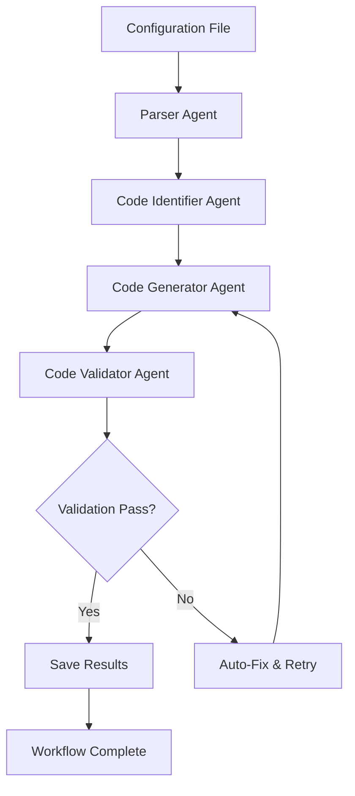

# AI Code Generator

🤖 **Intelligent Code Modification System using Multi-Agent Workflows**

An advanced AI-powered system that automatically modifies code files based on configuration specifications. Built with LangGraph and powered by LM Studio, this tool uses a multi-agent architecture to parse configurations, identify target files, generate code modifications, and validate results.

[](https://python.org)
[](https://github.com/langchain-ai/langgraph)
[](https://lmstudio.ai)

## 🌟 Key Features

- **Configuration-Driven Modifications**: Define changes through JSON configurations
- **Multi-Agent Architecture**: Four specialized AI agents working in orchestrated workflows
- **Intelligent File Detection**: Automatically identifies files requiring modifications
- **Advanced Code Generation**: Context-aware code generation with style preservation
- **Automated Validation**: Built-in code validation and auto-fixing capabilities
- **Interactive CLI**: User-friendly command-line interface with guided workflows
- **Comprehensive Logging**: Detailed execution tracking and error reporting
- **Local Processing**: All operations performed locally using LM Studio

## 🏗️ Architecture Overview

### Multi-Agent System



### Agent Responsibilities

| Agent | Purpose | Key Capabilities |
|-------|---------|-----------------|
| **Parser Agent** | Configuration analysis | JSON validation, metadata enrichment, error detection |
| **Code Identifier Agent** | File detection & planning | Smart file identification, dependency analysis, modification planning |
| **Code Generator Agent** | Code modification | Context-aware generation, multi-language support, style preservation |
| **Code Validator Agent** | Quality assurance | Syntax validation, logic verification, auto-fixing |

## 📋 Prerequisites

Before getting started, ensure you have:

- **Python 3.8+** installed on your system
- **[LM Studio](https://lmstudio.ai/)** downloaded and running
- **Compatible LLM model** loaded (recommended: CodeLlama 7B+, Mistral 7B+)
- **Git** for cloning the repository

### Recommended System Requirements

- **Minimum**: 16GB RAM, 8GB VRAM
- **Recommended**: 32GB RAM, 16GB+ VRAM
- **Storage**: 20GB+ free space for models

## 🚀 Installation & Setup

### 1. Clone and Navigate

```bash
git clone https://github.com/your-username/ai-agent-toolkit.git
cd ai-agent-toolkit/code_generator
```

### 2. Install Dependencies

```bash
pip install -r requirements.txt
```

### 3. Environment Configuration

Create a `.env` file in the code_generator directory:

```env
# LM Studio Configuration
LM_STUDIO_BASE_URL=http://localhost:1234/v1
LM_STUDIO_API_KEY=your-api-key-here
MODEL_NAME=your-model-name

# Generation Settings
TEMPERATURE=0.1
MAX_TOKENS=4000
TIMEOUT_SECONDS=60
```

### 4. Verify Setup

```bash
python main.py --validate-setup
```

## ⚙️ Configuration Format

### Basic Configuration Structure

```json
{
  "project": {
    "name": "my_data_pipeline_update",
    "description": "Update data loading configuration",
    "version": "1.0.0"
  },
  "modifications": {
    "data_sources": {
      "database": {
        "host": "new-server.com",
        "port": 5432,
        "database": "analytics_db"
      },
      "file_sources": [
        {
          "type": "csv",
          "path": "/data/input/",
          "pattern": "*.csv"
        }
      ]
    },
    "transformations": [
      {
        "type": "column_mapping",
        "old_column": "customer_id",
        "new_column": "client_id"
      }
    ]
  },
  "target_files": [
    "data_loader.py",
    "pipeline.py",
    "config.py"
  ]
}
```

### Advanced Configuration Options

```json
{
  "project": {
    "name": "advanced_pipeline_update",
    "description": "Complex data pipeline modifications",
    "version": "2.0.0",
    "author": "Data Engineering Team"
  },
  "modifications": {
    "data_sources": {
      "database": {
        "host": "prod-db-cluster.company.com",
        "port": 5432,
        "database": "warehouse_db",
        "schema": "analytics",
        "connection_pool": {
          "min_connections": 5,
          "max_connections": 20
        }
      },
      "api_sources": [
        {
          "name": "customer_api",
          "endpoint": "https://api.company.com/customers",
          "auth_type": "bearer_token",
          "rate_limit": 1000
        }
      ],
      "file_sources": [
        {
          "type": "parquet",
          "path": "/data/warehouse/",
          "partition_by": ["year", "month"],
          "compression": "snappy"
        }
      ]
    },
    "transformations": [
      {
        "type": "data_validation",
        "rules": [
          {
            "column": "email",
            "validation": "email_format"
          },
          {
            "column": "age",
            "validation": "range",
            "min": 0,
            "max": 120
          }
        ]
      },
      {
        "type": "data_enrichment",
        "source": "customer_api",
        "join_key": "customer_id",
        "fields": ["segment", "lifetime_value"]
      }
    ],
    "output_format": {
      "type": "delta_table",
      "location": "/data/delta/customers",
      "partition_by": ["region", "signup_date"],
      "optimization": {
        "auto_optimize": true,
        "z_order": ["customer_id"]
      }
    }
  },
  "target_files": [
    "src/data_loader.py",
    "src/transformers/base_transformer.py",
    "config/pipeline_config.py",
    "schemas/customer_schema.py"
  ],
  "generation_preferences": {
    "code_style": "pep8",
    "add_comments": true,
    "add_logging": true,
    "error_handling": "comprehensive"
  }
}
```

## 🎯 Usage Guide

### Command Line Interface

#### Basic Usage

```bash
# Process with configuration file and project path
python main.py --config examples/sample_config.json --project examples/sample_project

# Interactive mode (recommended for beginners)
python main.py --interactive

# Create sample configuration template
python main.py --create-sample-config

# Validate system setup
python main.py --validate-setup
```

#### Advanced Options

```bash
# Custom logging levels
python main.py --config config.json --project /path/to/project --log-level DEBUG

# Custom output directory
python main.py --config config.json --project /path/to/project --output /custom/output/path

# Specific log file
python main.py --config config.json --project /path/to/project --log-file custom_execution.log

# Dry run mode (no files modified)
python main.py --config config.json --project /path/to/project --dry-run
```

### Interactive Mode

The interactive mode provides a guided experience:

```bash
python main.py --interactive
```

This presents a menu with options to:
1. **Process Configuration Files** - Load and process JSON configurations
2. **Validate System Setup** - Check LM Studio connection and dependencies
3. **View Execution Logs** - Review recent workflow executions
4. **Create Sample Config** - Generate template configurations
5. **Exit** - Close the application

### Programmatic Usage

```python
from workflow.graph import CodeGenerationWorkflow
from utils.file_handler import FileHandler
from pathlib import Path

# Initialize workflow
workflow = CodeGenerationWorkflow()

# Load configuration
config_data = FileHandler.read_json_file(Path("config.json"))

# Run workflow
results = workflow.run_workflow(config_data, "/path/to/project")

# Check results
if results["status"] == "completed":
    print(f"Successfully modified {results['files_modified']} files")
    for log_entry in results["execution_log"]:
        print(log_entry)
else:
    print(f"Workflow failed: {results['errors']}")
```

## 📁 Project Structure

```
code_generator/
├── agents/                          # AI Agent implementations
│   ├── __init__.py
│   ├── parser_agent.py             # Configuration parsing & validation
│   ├── code_identifier_agent.py    # File detection & modification planning
│   ├── code_generator_agent.py     # Code generation & modification
│   └── code_validator_agent.py     # Code validation & auto-fixing
├── config/                         # Configuration management
│   ├── __init__.py
│   └── settings.py                 # Application settings & defaults
├── examples/                       # Sample configurations & projects
│   ├── sample_project/
│   │   ├── data_loader.py         # Example target file
│   │   └── pipeline.py            # Example target file
│   └── sample_config.json         # Example configuration
├── utils/                          # Utility modules
│   ├── __init__.py
│   ├── file_handler.py            # File I/O operations
│   └── llm_client.py              # LM Studio client interface
├── workflow/                       # LangGraph workflow orchestration
│   ├── __init__.py
│   └── graph.py                   # Main workflow implementation
├── main.py                        # CLI entry point
├── README.md                      # This documentation
└── requirements.txt               # Python dependencies
```

## 🤖 Agent Details

### Parser Agent (`agents/parser_agent.py`)

**Responsibilities:**
- Parse and validate JSON configurations
- Enrich configurations with metadata
- Detect configuration errors and inconsistencies

**Key Methods:**
```python
def parse_config(self, config_data: Dict) -> Dict
def validate_config(self, parsed_config: Dict) -> Dict
def enrich_metadata(self, config: Dict) -> Dict
```

### Code Identifier Agent (`agents/code_identifier_agent.py`)

**Responsibilities:**
- Scan project directories for target files
- Analyze file dependencies and relationships
- Create comprehensive modification plans

**Key Methods:**
```python
def identify_target_files(self, config: Dict, project_path: Path) -> List[Dict]
def create_modification_plan(self, target_files: List, config: Dict) -> Dict
def analyze_file_dependencies(self, file_path: Path) -> Dict
```

### Code Generator Agent (`agents/code_generator_agent.py`)

**Responsibilities:**
- Generate code modifications based on plans
- Preserve existing code style and patterns
- Handle multiple programming languages

**Key Methods:**
```python
def generate_code_modifications(self, modification_plan: Dict) -> Dict
def preserve_code_style(self, original_code: str, new_code: str) -> str
def apply_modifications(self, file_content: str, modifications: List) -> str
```

### Code Validator Agent (`agents/code_validator_agent.py`)

**Responsibilities:**
- Validate syntax and logical correctness
- Automatically fix common issues
- Generate validation reports

**Key Methods:**
```python
def validate_code_changes(self, generated_code: List[Dict]) -> Dict
def auto_fix_issues(self, code_content: str, errors: List) -> str
def generate_validation_report(self, results: Dict) -> Dict
```

## 🔧 Configuration Options

### Environment Variables

| Variable | Description | Default |
|----------|-------------|---------|
| `LM_STUDIO_BASE_URL` | LM Studio API endpoint | `http://localhost:1234/v1` |
| `LM_STUDIO_API_KEY` | API key for authentication | `your-api-key-here` |
| `MODEL_NAME` | Name of the loaded model | `your-model-name` |
| `TEMPERATURE` | Generation temperature | `0.1` |
| `MAX_TOKENS` | Maximum token limit | `4000` |
| `TIMEOUT_SECONDS` | Request timeout | `60` |

### Application Settings (`config/settings.py`)

```python
# Default generation parameters
DEFAULT_TEMPERATURE = 0.1
DEFAULT_MAX_TOKENS = 4000
DEFAULT_TIMEOUT = 60

# Validation settings
MAX_RETRY_ATTEMPTS = 3
AUTO_FIX_ENABLED = True

# File handling
SUPPORTED_FILE_TYPES = ['.py', '.js', '.java', '.cpp', '.c', '.go']
BACKUP_ORIGINAL_FILES = True

# Logging configuration
LOG_LEVEL = "INFO"
LOG_FORMAT = "%(asctime)s - %(name)s - %(levelname)s - %(message)s"
```

## 📊 Output & Results

### Generated Output Structure

```
output/generated_code/
├── modified_files/
│   ├── data_loader.py          # Modified source files
│   ├── pipeline.py
│   └── config.py
├── backups/                    # Original file backups
│   ├── data_loader.py.backup
│   ├── pipeline.py.backup
│   └── config.py.backup
├── workflow_metadata.json      # Execution metadata
├── validation_report.json      # Code validation results
└── execution_log.txt          # Detailed execution log
```

### Workflow Metadata Example

```json
{
  "start_time": "2024-01-15T10:30:00Z",
  "end_time": "2024-01-15T10:35:30Z",
  "status": "completed",
  "files_processed": 3,
  "execution_steps": [
    {
      "step": "parsing_config",
      "status": "completed",
      "duration": "0.5s",
      "details": "Successfully parsed configuration with 3 modification rules"
    },
    {
      "step": "identifying_code",
      "status": "completed", 
      "duration": "2.1s",
      "details": "Identified 3 target files requiring modifications"
    },
    {
      "step": "generating_code",
      "status": "completed",
      "duration": "15.3s", 
      "details": "Generated modifications for all target files"
    },
    {
      "step": "validating_code",
      "status": "completed",
      "duration": "3.2s",
      "details": "All generated code passed validation"
    }
  ],
  "performance_metrics": {
    "total_execution_time": "21.1s",
    "lines_of_code_modified": 127,
    "validation_score": 0.98
  }
}
```

## 🛠️ Troubleshooting

### Common Issues & Solutions

#### LM Studio Connection Problems

**Problem**: `ConnectionError: Unable to connect to LM Studio`

**Solutions:**
```bash
# Check if LM Studio is running
curl http://localhost:1234/v1/models

# Verify environment configuration
python main.py --validate-setup

# Check firewall/network settings
netstat -an | grep 1234
```

#### Configuration Parsing Errors

**Problem**: `JSON parsing failed` or `Invalid configuration format`

**Solutions:**
- Validate JSON syntax using online tools
- Check required fields are present
- Verify file paths exist
- Use sample configuration as template

#### Code Generation Issues

**Problem**: Generated code is incomplete or incorrect

**Solutions:**
- Reduce configuration complexity
- Increase `MAX_TOKENS` in environment
- Lower `TEMPERATURE` for more consistent output
- Check model compatibility

#### File Permission Errors

**Problem**: `Permission denied` when writing files

**Solutions:**
```bash
# Check file permissions
ls -la /path/to/project

# Fix permissions
chmod 755 /path/to/project
chmod 644 /path/to/project/*.py

# Run with appropriate privileges
sudo python main.py --config config.json --project /path/to/project
```

### Debug Mode

Enable comprehensive debugging:

```bash
# Enable debug logging
python main.py --log-level DEBUG --config config.json --project project_path

# Save debug output to file
python main.py --log-level DEBUG --log-file debug.log --config config.json --project project_path

# Verbose output with timing
python main.py --verbose --config config.json --project project_path
```

### Health Check

Run comprehensive system validation:

```bash
# Full system check
python main.py --validate-setup --verbose

# Check specific components
python -c "
from utils.llm_client import LMStudioClient
client = LMStudioClient()
print('LM Studio Status:', client.health_check())
"
```

## 📈 Performance Optimization

### Model Selection Guidelines

| Use Case | Recommended Model | VRAM Req | Performance |
|----------|------------------|----------|-------------|
| Simple modifications | CodeLlama 7B | 8GB | Fast |
| Complex refactoring | CodeLlama 13B | 16GB | Balanced |
| Enterprise projects | Mistral 7B | 8GB | High Quality |
| Multi-language support | DeepSeek Coder 6.7B | 8GB | Versatile |

### Configuration Optimization

```json
{
  "generation_preferences": {
    "batch_size": 5,              // Process multiple files together
    "use_caching": true,          // Cache LLM responses
    "parallel_validation": true,   // Validate files in parallel
    "incremental_generation": true // Generate code incrementally
  },
  "performance_settings": {
    "max_file_size_mb": 10,       // Skip very large files
    "timeout_per_file": 30,       // Per-file timeout
    "memory_limit_mb": 1024       // Memory usage limit
  }
}
```

### System Optimization Tips

1. **Hardware Optimization**
   - Use SSD storage for faster file I/O
   - Ensure adequate RAM for model loading
   - Use GPU acceleration if available

2. **Configuration Optimization**
   - Group related modifications together
   - Use specific file targeting
   - Minimize unnecessary transformations

3. **Workflow Optimization**
   - Process similar files in batches
   - Use incremental processing for large projects
   - Enable caching for repeated operations

## 🧪 Testing & Validation

### Unit Testing

```bash
# Run all tests
python -m pytest tests/ -v

# Test specific components
python -m pytest tests/test_parser_agent.py -v
python -m pytest tests/test_code_generator.py -v

# Test with coverage
python -m pytest tests/ --cov=agents --cov-report=html
```

### Integration Testing

```bash
# Test complete workflow
python main.py --config examples/sample_config.json --project examples/sample_project --dry-run

# Test with different configurations
python tests/integration_test.py
```

### Sample Test Configuration

```json
{
  "project": {
    "name": "test_pipeline",
    "description": "Test configuration for validation"
  },
  "modifications": {
    "simple_replacements": [
      {
        "file_pattern": "*.py",
        "find": "old_function_name",
        "replace": "new_function_name"
      }
    ]
  },
  "target_files": ["examples/sample_project/data_loader.py"]
}
```

## 🔒 Security & Best Practices

### Security Considerations

- **Local Processing**: All operations performed locally
- **No External API Calls**: Data never leaves your environment
- **File Backup**: Original files automatically backed up
- **Access Control**: Respect file system permissions
- **Input Validation**: All configurations validated before processing

### Best Practices

1. **Configuration Management**
   - Version control your configurations
   - Use descriptive names and comments
   - Test configurations on sample projects first

2. **File Handling**
   - Always backup important files
   - Use version control for target projects
   - Review generated changes before deployment

3. **Model Management**
   - Use appropriate models for your use case
   - Monitor model performance and accuracy
   - Keep models updated

4. **Workflow Management**
   - Monitor execution logs
   - Set appropriate timeouts
   - Handle errors gracefully

## 🤝 Contributing

We welcome contributions to improve the AI Code Generator! Here's how to get started:

### Development Setup

```bash
# Fork and clone the repository
git clone https://github.com/your-username/ai-agent-toolkit.git
cd ai-agent-toolkit/code_generator

# Create development environment
python -m venv venv
source venv/bin/activate  # On Windows: venv\Scripts\activate

# Install development dependencies
pip install -r requirements.txt
pip install -r requirements-dev.txt

# Set up pre-commit hooks
pre-commit install
```

### Contribution Guidelines

1. **Code Standards**
   - Follow PEP 8 style guidelines
   - Add comprehensive docstrings
   - Include type hints where appropriate
   - Write unit tests for new features

2. **Documentation**
   - Update README for new features
   - Add docstring documentation
   - Include usage examples

3. **Testing**
   - Write unit tests for new agents
   - Add integration tests for workflows
   - Ensure all tests pass before submitting

4. **Pull Request Process**
   - Create feature branch: `git checkout -b feature/amazing-feature`
   - Make changes and add tests
   - Commit changes: `git commit -m 'Add amazing feature'`
   - Push to branch: `git push origin feature/amazing-feature`
   - Open Pull Request with detailed description

### Development Tasks

```bash
# Run linting
flake8 agents/ utils/ workflow/

# Format code
black agents/ utils/ workflow/

# Type checking
mypy agents/ utils/ workflow/

# Run tests
pytest tests/ -v --cov

# Build documentation
sphinx-build -b html docs/ docs/_build/
```

## 📚 Additional Resources

### Documentation

- [LangGraph Documentation](https://python.langchain.com/docs/langgraph)
- [LM Studio Documentation](https://lmstudio.ai/docs)
- [Python Type Hints Guide](https://docs.python.org/3/library/typing.html)

### Example Projects

- **Data Pipeline Modernization**: Update legacy ETL scripts
- **API Integration**: Add new API endpoints to existing services  
- **Configuration Migration**: Migrate from one config format to another
- **Code Refactoring**: Systematic refactoring of large codebases

### Community

- **GitHub Discussions**: Ask questions and share experiences
- **Issue Tracker**: Report bugs and request features
- **Examples Repository**: Community-contributed configurations

## 📄 License

This project is licensed under the MIT License - see the [LICENSE](../LICENSE) file for details.

## 🙏 Acknowledgments

- **LangGraph Team** for the excellent workflow orchestration framework
- **LM Studio** for providing local LLM hosting capabilities
- **Open Source Community** for inspiration and continuous improvement
- **Contributors** who help make this project better

---

**Built with ❤️ for developers who believe AI should enhance, not replace, human creativity**

*Star ⭐ this repository if you find it useful!*